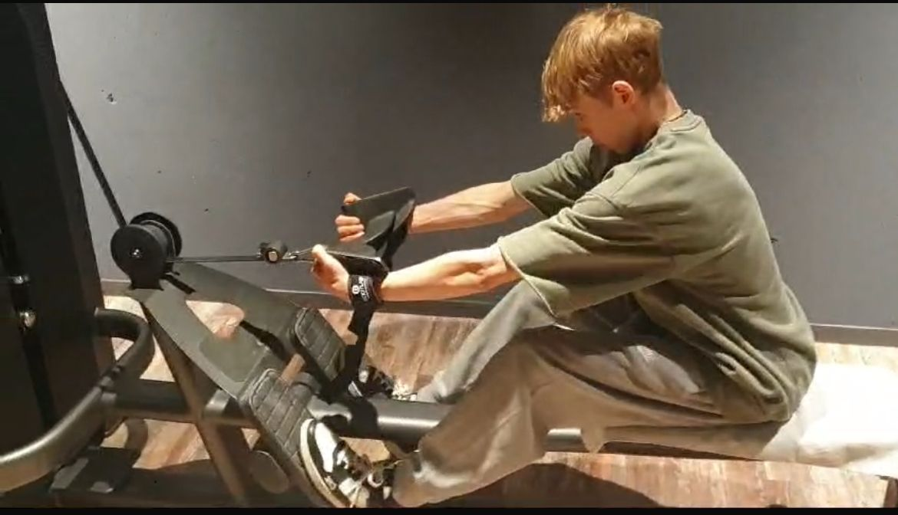

+++
title = "Gym und Selbstbild"
date = "2024-02-27"
draft = false
pinned = true
tags = ["Gym", "Interview", "Identität"]
image = "pexels-photo-260352.webp"
description = ""
footnotes = "In der Fusszeile können zum Beispiel Bildquellen angegeben werden. Dieser Text ist abgetrennt durch eine Linie und etwas kleiner."
+++
# Disziplin, Fortschritt und der Einfluss des Gyms auf das Selbstbild



**Sich im eigenen Körper wohlfühlen und das Selbstbewusstsein stärken – das war der Antrieb für Flurin, mit dem Gym Training zu beginnen. Mittlerweile hat er sein Leben dem Fitness verschrieben. Im Interview steht im Mittelpunkt die Herausforderungen, Disziplin und den ständigen Vergleich mit Social Media-Vorbildern.**



> *"Das Training ist das Hauptziel meines Tages."*
>
> *Flurin Liebold*

*An einem späten Nachmittag, nach einem anstrengenden Training im Update Fitness Marktgasse, setzen wir uns an ein ruhiges Plätzchen im Gym, abseits der lauten Menschen, die noch trainieren.*

**Samuel Miescher: Was hat dich dazu gebracht, mit dem Training im Gym anzufangen?**\
**Flurin Liebold:** Das hatte zwei Gründe. Zum einen fühlte ich mich nicht wohl in meinem Körper, zum anderen wollte ich etwas verändern.



Flurin Antonio Liebold begann mit 13 zuhause zu trainieren und wechselte mit 14 in ein professionelles Gym. Seitdem hat er rund 20 kg Muskelmasse aufgebaut und trainiert bis zu sechsmal pro Woche. Trotz Rückschlägen, wie einem gebrochenen Arm, bleibt er diszipliniert und passt sein Training den umständen an.



**Gab es einen bestimmten Moment, der dich dazu gebracht hat, ernsthaft mit dem Fitness anzufangen?**\
Ja, das war der Hauptgrund. Ich war sehr, sehr dünn und wollte mein Selbstwertgefühl verbessern. Also habe ich mit 13 zu Hause angefangen zu trainieren. Mit 14 habe ich mich dann schliesslich im Gym angemeldet und trainierte dort seitdem viermal die Woche, heutzutage sogar sechsmal in der Woche.

**Hat sich dein Selbstbild durch das Training positiv verändert?**\
Ich glaube das ich mein Selbstbewusstsein auf andere Menschen eindeutig verbessert hat. Aber für mich merke ich keinen riesigen Unterschied, ich fühle mich nicht breiter oder grösser als vorher. Andere nehmen das vielleicht anders wahr.

> *"Es ist ein Sport der sehr viel vom Alltag beeinträchtigt"*
>
> *Flurin Liebold*

**Hast du ein bestimmtes Mindset das hilft dir, motiviert zu bleiben?**\
Ich habe kein bestimmtes Mindset, aber egal, wie ich mich fühle - gut, schlecht oder wenn ich müde bin – das Training ist das Hauptziel des Tages. Ich plane meinen ganzen Tag um mein Training herum.

**Wie beeinflusst das dein Leben in anderen Bereichen, zum Beispiel Ernährung und Schlaf?**\
Sehr stark. Ich achte sehr auf meine Ernährung und vor allem darauf, jede Nacht 9-10 Stunden zu schlafen und habe ein gewisses Ernährungsziel, das ich jedem Tag verfolge. Daher plane ich jeden Tag meine Mahlzeiten, trainiere 2 Stunden täglich und dazu meistens noch 30 Minuten Cardio. Dadurch bleibt leider wenig Zeit für soziale Kontakte oder spontane Treffen. Es ist ein Sport der sehr viel vom Alltag beeinträchtigt

**Wie würdest du deinen Fortschritt im Gym seit deinem Trainingsbeginn beschreiben?**\
Ich habe mit extrem wenig Muskelmasse angefangen. Vorher hatte ich fast keine, und jetzt würde ich mich als Durchschnittlich bezeichnen. Hätte ich damals schon so ausgesehen wie jetzt, würde ich wahrscheinlich breiter aussehen. Ich bin jetzt ungefähr 20 Kilo schwerer als am Anfang. Anfangs wog ich 37 Kilo, jetzt bin ich um die 58 Kilo schwer.

**Fühlst du dich unter Druck gesetzt, einem bestimmten Körperideal zu entsprechen?**\
Ich denke, das geht jedem so. Man verfolgt immer ein Ziel, wie man aussehen will und hat ein grobes Bild davon. Aber das Ziel ist wahrscheinlich unerreichbar.

> *Social Media sollte nicht als Vorlage dienen, sondern als Hilfe und Motivation*
>
> *Flurin Liebold*

 **Welche Rolle spielt Social Media im Zusammenhang mit dem Gym für dich?**\
Für mich hat Social Media ein Art Vorbildfunktion. Es gibt viele Fitness Influencer die ihre Trainingseinheiten zeigen und wie sie ihren Alltag gestalten. Das kann motivierend sein.

**Setzten Fitness Influencer unrealistische Erwartungen?**\
Ja, ganz bestimmt. Man muss wissen, dass viel inszeniert ist. Viele Bilder auf Social Media sind oft in perfekten zuständen aufgenommen und in den meisten Fällen verheimlichen diese Influencer das sie nicht ständig fit aussehen. Aber ich bekomme schon Motivation von verschieden Bodybuilder oder Kraftsportler, denen ich täglich ihre Videos schaue. Zusammenfassend sollte Social Media daher, nicht als Vorlage dienen, sondern als Hilfe und Motivation.

**Du hast dir kürzlich den Arm gebrochen. Wie gehst du damit?**\
Anfangs war es sehr schwer, weil ich nicht wusste, wie ich weitertrainieren soll. Aber vier Tage nach der Operation habe ich meinen Trainingsplan umgeschrieben und war wieder im Gym am Trainieren. Ich trainiere jetzt nur mit der rechten Seite und trainiere weiterhin meine Beine. Leider war es Anfangs sehr unangenehm, weil ich nicht wusste, wie es mit dem Training weitergeht.

**Was motiviert dich, trotz der Verletzung weiterzumachen?**\
Die Disziplin hat mir sehr geholfen. Außerdem gibt es einen speziellen Effekt, dass wenn man eine Seite trainiert, wird die andere Seite auch wenig stimuliert, weil die Nervensysteme miteinander verbunden sind. Dadurch verliere ich nicht komplett die Muskelmasse auf der linken Seite. Das gibt mit auch Motivation, weil ich nicht viel fortschritt auf meiner linken Seite verliere